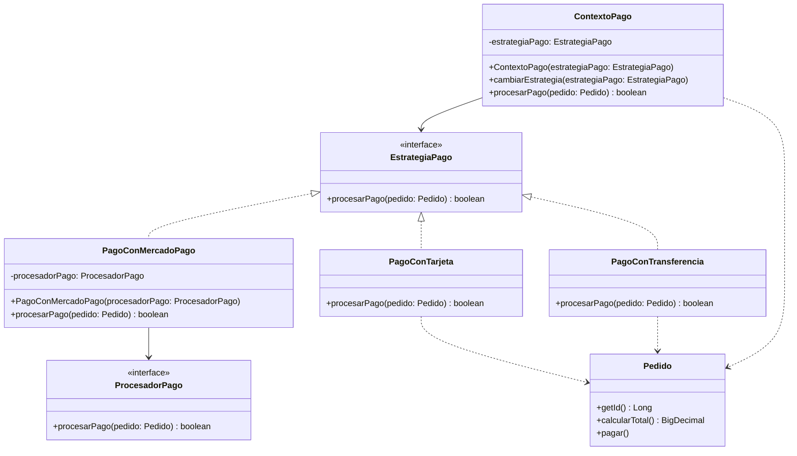

# Strategy

## Problema

En un e-commerce es habitual ofrecer distintas formas de pago, como Mercado Pago, tarjeta o transferencia bancaria.

Aunque todas persiguen el mismo objetivo (procesar el pago de un pedido), cada alternativa necesita una lógica diferente.

Sin aplicar el patrón Strategy, podríamos concentrar todas las variantes en una misma clase mediante condicionales:

```java
if (metodoDePago == MetodoDePago.MERCADO_PAGO) {
    // Procesar el pago mediante Mercado Pago
} else if (metodoDePago == MetodoDePago.TARJETA_CREDITO) {
    // Procesar el pago con tarjeta
} else if (metodoDePago == MetodoDePago.TRANSFERENCIA) {
    // Generar los datos para una transferencia
}
```

A medida que se agregan nuevas formas de pago, esta estructura crece y se vuelve más difícil de mantener.

Además, cada modificación obliga a cambiar la lógica existente, incluso cuando solamente queremos incorporar una nueva alternativa.

---

## Solución

El patrón **Strategy** permite encapsular distintos algoritmos o comportamientos en clases independientes que comparten una interfaz común.

En este ejemplo, todas las estrategias de pago implementan la interfaz `EstrategiaPago`.

```java
public interface EstrategiaPago {
    boolean procesarPago(Pedido pedido);
}
```

Cada implementación define una forma diferente de procesar el pago:

- `PagoConMercadoPago`
- `PagoConTarjeta`
- `PagoConTransferencia`

La clase `ContextoPago` recibe una estrategia y delega en ella el procesamiento del pedido sin conocer los detalles de su implementación.

De esta manera, el comportamiento puede cambiar sin modificar el código que lo utiliza.

---

## Antes y después de aplicar Strategy

### Sin Strategy

Sin aplicar el patrón, la selección del medio de pago podría concentrarse en una cadena de condicionales:

```java
public boolean procesarPago(Pedido pedido) {
    if (pedido.getMetodoDePago() == MetodoDePago.MERCADO_PAGO) {
        return procesarConMercadoPago(pedido);
    }

    if (pedido.getMetodoDePago() == MetodoDePago.TARJETA_CREDITO) {
        return procesarConTarjeta(pedido);
    }

    if (pedido.getMetodoDePago() == MetodoDePago.TRANSFERENCIA) {
        return procesarConTransferencia(pedido);
    }

    throw new IllegalArgumentException("Método de pago no soportado");
}
```

Esta solución reúne comportamientos diferentes en una misma clase.

Cada vez que aparece una nueva forma de pago, es necesario modificar el código existente y agregar otra condición.

### Con Strategy

Con Strategy, cada forma de pago se encapsula en una clase independiente:

```java
EstrategiaPago estrategiaPago = new PagoConMercadoPago(mercadoPagoAdapter);

ContextoPago contextoPago = new ContextoPago(estrategiaPago);

boolean pagoExitoso = contextoPago.procesarPago(pedido);
```

El código cliente trabaja con la interfaz `EstrategiaPago` y no necesita conocer cómo procesa el pago cada implementación concreta.

Para utilizar otra estrategia al crear el contexto, alcanza con proporcionar una implementación diferente:

```java
ContextoPago contextoPago = new ContextoPago(new PagoConTarjeta());
```

o:

```java
ContextoPago contextoPago = new ContextoPago(new PagoConTransferencia());
```

La forma de ejecutar el pago continúa siendo la misma:

```java
contextoPago.procesarPago(pedido);
```

---

## Ejemplo en este proyecto

En este proyecto, el `Pedido` se construye previamente mediante el patrón **Builder**.

Luego, `ContextoPago` recibe una implementación de `EstrategiaPago` y delega en ella el procesamiento del pago.

```java
EstrategiaPago estrategiaPago = new PagoConMercadoPago(mercadoPagoAdapter);

ContextoPago contextoPago = new ContextoPago(estrategiaPago);

boolean pagoExitoso = contextoPago.procesarPago(pedido);
```

`ContextoPago` no conoce los pasos necesarios para pagar mediante Mercado Pago, tarjeta o transferencia.

Su responsabilidad es mantener una referencia a la estrategia seleccionada y delegar la operación:

```java
public boolean procesarPago(Pedido pedido) {
    if (pedido == null) {
        throw new IllegalArgumentException("El pedido no puede ser nulo");
    }

    return estrategiaPago.procesarPago(pedido);
}
```

Cada estrategia concreta contiene su propio comportamiento.

Por ejemplo, `PagoConTarjeta` obtiene el importe del pedido y simula el procesamiento del pago:

```java
public class PagoConTarjeta implements EstrategiaPago {

    @Override
    public boolean procesarPago(Pedido pedido) {
        BigDecimal importe = pedido.calcularTotal();

        System.out.println("Estrategia seleccionada: Tarjeta");
        System.out.println("Procesando pago con tarjeta");
        System.out.println("Importe: $" + importe);

        return importe.compareTo(BigDecimal.ZERO) > 0;
    }
}
```

En cambio, `PagoConTransferencia` genera una referencia para identificar la operación:

```java
public class PagoConTransferencia implements EstrategiaPago {

    @Override
    public boolean procesarPago(Pedido pedido) {
        BigDecimal importe = pedido.calcularTotal();

        System.out.println("Estrategia seleccionada: Transferencia");
        System.out.println("Generando los datos para la transferencia");
        System.out.println("Referencia: TRANSF-PED-" + pedido.getId());
        System.out.println("Importe: $" + importe);

        return importe.compareTo(BigDecimal.ZERO) > 0;
    }
}
```

---

## Integración con Adapter

La estrategia `PagoConMercadoPago` reutiliza el patrón **Adapter** implementado anteriormente.

```java
ProcesadorPago mercadoPagoAdapter = new MercadoPagoAdapter(new MercadoPagoAPI());

EstrategiaPago estrategiaPago = new PagoConMercadoPago(mercadoPagoAdapter);
```

`PagoConMercadoPago` representa la estrategia elegida para procesar el pago, mientras que `MercadoPagoAdapter` se encarga de adaptar el objeto `Pedido` al formato requerido por `MercadoPagoAPI`.

```java
public class PagoConMercadoPago implements EstrategiaPago {

    private final ProcesadorPago procesadorPago;

    public PagoConMercadoPago(ProcesadorPago procesadorPago) {
        if (procesadorPago == null) {
            throw new IllegalArgumentException("El procesador de pago no puede ser nulo");
        }

        this.procesadorPago = procesadorPago;
    }

    @Override
    public boolean procesarPago(Pedido pedido) {
        System.out.println("Estrategia seleccionada: Mercado Pago");

        return procesadorPago.procesarPago(pedido);
    }
}
```

En esta colaboración, cada patrón mantiene una responsabilidad diferente:

- **Strategy** encapsula las distintas formas de procesar el pago y permite intercambiarlas.
- **Adapter** traduce la información del pedido al formato esperado por la API externa.

El flujo completo queda así:

```text
PedidoBuilder
      │
      ▼
    Pedido
      │
      ▼
 ContextoPago
      │
      ▼
PagoConMercadoPago
      │
      ▼
MercadoPagoAdapter
      │
      ▼
MercadoPagoAPI
```

---

## ¿Por qué utilizar un contexto?

La clase `ContextoPago` mantiene una referencia a la estrategia seleccionada y ofrece un punto común para ejecutar el pago.

```java
public class ContextoPago {

    private EstrategiaPago estrategiaPago;

    public ContextoPago(EstrategiaPago estrategiaPago) {
        validarEstrategia(estrategiaPago);
        this.estrategiaPago = estrategiaPago;
    }

    public boolean procesarPago(Pedido pedido) {
        if (pedido == null) {
            throw new IllegalArgumentException("El pedido no puede ser nulo");
        }

        return estrategiaPago.procesarPago(pedido);
    }
}
```

El contexto no implementa la lógica de cada medio de pago. Solamente delega la operación en el objeto configurado.

Esto permite que el código cliente utilice siempre la misma operación:

```java
contextoPago.procesarPago(pedido);
```

sin importar cuál sea la estrategia concreta.

---

## Cambio de estrategia en tiempo de ejecución

`ContextoPago` también permite reemplazar la estrategia configurada:

```java
public void cambiarEstrategia(EstrategiaPago estrategiaPago) {
    validarEstrategia(estrategiaPago);
    this.estrategiaPago = estrategiaPago;
}
```

Por ejemplo:

```java
ContextoPago contextoPago = new ContextoPago(new PagoConTarjeta());

contextoPago.cambiarEstrategia(new PagoConTransferencia());
```

De esta manera, el comportamiento puede cambiar durante la ejecución sin modificar la clase `ContextoPago`.

En este ejemplo no se procesa dos veces el mismo pedido. El cambio de estrategia se muestra para representar que el contexto puede configurarse dinámicamente antes de ejecutar la operación.

---

## Diferencia entre Strategy y Factory Method

Aunque ambos patrones suelen utilizar una interfaz con varias implementaciones, resuelven problemas diferentes.

**Factory Method** responde:

> ¿Qué objeto se debe crear?

En el ejemplo de notificaciones, cada creador concreto decide si crear una instancia de `NotificacionEmail`, `NotificacionWhatsApp` o `NotificacionSms`.

**Strategy** responde:

> ¿Qué comportamiento o algoritmo se debe ejecutar?

En este ejemplo, el pedido ya existe. Lo que cambia es la forma de procesar su pago:

- mediante Mercado Pago;
- mediante tarjeta;
- mediante transferencia.

Factory Method se enfoca en la **creación de objetos**, mientras que Strategy se enfoca en intercambiar **comportamientos**.

---

## Diagrama UML



En este diagrama se puede ver que `PagoConMercadoPago`, `PagoConTarjeta` y `PagoConTransferencia` implementan la interfaz `EstrategiaPago`.

`ContextoPago` mantiene una referencia a esa interfaz y delega el procesamiento del pago en la estrategia configurada.

Además, `PagoConMercadoPago` utiliza la interfaz `ProcesadorPago`, que permite reutilizar el Adapter creado para integrar la API externa de Mercado Pago.

---

## Código principal

```java
ProcesadorPago mercadoPagoAdapter = new MercadoPagoAdapter(new MercadoPagoAPI());

EstrategiaPago estrategiaPago = new PagoConMercadoPago(mercadoPagoAdapter);

ContextoPago contextoPago = new ContextoPago(estrategiaPago);

boolean pagoExitoso = contextoPago.procesarPago(pedido);

if (pagoExitoso) {
    pedido.pagar();
}

System.out.println("Pago exitoso: " + pagoExitoso);
System.out.println("Estado del pedido: " + pedido.getEstadoPedido());
```

El código cliente configura la estrategia al crear `ContextoPago`. A partir de ese momento, el pago siempre se ejecuta mediante `contextoPago.procesarPago(...)`, sin importar cuál sea la estrategia seleccionada.

Si el resultado es exitoso, el pedido cambia su estado a `PAGADO`.

---

## Estructura del ejemplo

```text
strategy/
│
├── ContextoPago.java
├── EstrategiaPago.java
├── PagoConMercadoPago.java
├── PagoConTarjeta.java
├── PagoConTransferencia.java
└── StrategyDemo.java
```

El ejemplo también reutiliza:

```text
creacionales/
└── builder/
    └── PedidoBuilder.java

estructurales/
└── adapter/
    ├── MercadoPagoAPI.java
    ├── MercadoPagoAdapter.java
    └── ProcesadorPago.java

ecommerce/
└── Pedido.java
```

---

## Código fuente

El código completo del ejemplo se encuentra en:

[Ver código de Strategy](../../src/main/java/com/bren/patrones/comportamiento/strategy)

---

## Cuándo usar Strategy

Conviene utilizar Strategy cuando:

- Existen distintas formas de realizar una misma operación.
- Un comportamiento debe poder cambiar durante la ejecución.
- La lógica está concentrada en numerosos `if`, `else` o `switch`.
- Se busca agregar nuevos comportamientos sin modificar los existentes.
- Queremos separar cada algoritmo en una clase independiente.
- Varias clases se diferencian principalmente por la forma en que realizan una tarea.

---

## Cuándo no usarlo

No conviene aplicar Strategy cuando:

- Solo existe una forma de realizar la operación.
- Los comportamientos son muy simples y no se espera que cambien.
- Agregar múltiples clases genera más complejidad que beneficio.
- La diferencia entre las alternativas se limita a pocos valores y no a comportamientos distintos.

---

## Resumen

Strategy es un patrón de comportamiento que permite encapsular distintos algoritmos en clases independientes e intercambiables.

En este ejemplo, `PagoConMercadoPago`, `PagoConTarjeta` y `PagoConTransferencia` representan distintas estrategias para procesar el pago de un `Pedido`.

`ContextoPago` trabaja únicamente con la interfaz `EstrategiaPago`, por lo que puede utilizar cualquiera de estas implementaciones sin conocer sus detalles internos.

Además, la estrategia de Mercado Pago reutiliza el patrón Adapter para comunicarse con una API externa, mostrando cómo distintos patrones pueden colaborar dentro del mismo e-commerce.

De esta manera, el sistema evita concentrar todas las variantes en condicionales y permite incorporar nuevas formas de pago sin modificar la lógica existente.