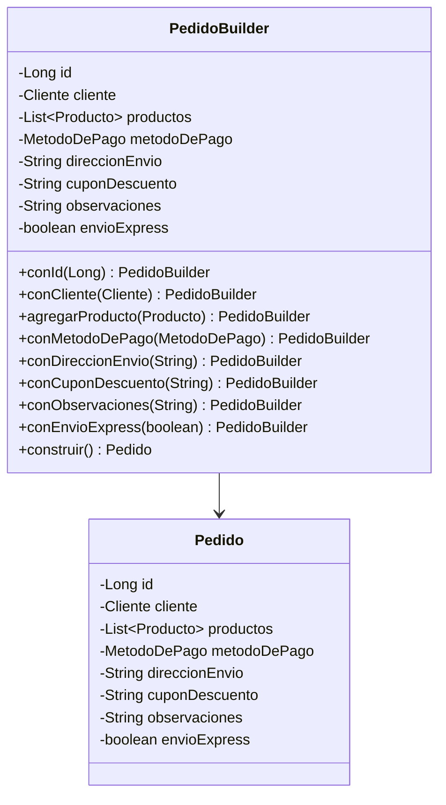

# Builder

## Problema

En un e-commerce, un pedido puede tener muchos datos, algunos obligatorios y otros opcionales.

Por ejemplo, además del cliente y el método de pago, un pedido puede incluir:

- productos
- dirección de envío
- cupón de descuento
- observaciones
- envío express

Sin aplicar el patrón Builder, podríamos terminar utilizando un constructor con muchos parámetros.

A medida que el objeto crece, el constructor se vuelve difícil de leer, es fácil equivocarse en el orden de los parámetros y aparecen valores opcionales que muchas veces no son necesarios.

## Solución

Builder permite construir un objeto paso a paso mediante una clase dedicada exclusivamente a su creación. Esta clase actúa como un intermediario entre el código cliente y el objeto que se quiere construir, reuniendo toda la información necesaria antes de crear la instancia final.

En lugar de recibir todos los datos en un único constructor, el Builder ofrece métodos para configurar únicamente la información necesaria y finalmente crear el objeto.

De esta forma la construcción queda más legible y resulta más sencillo distinguir los datos obligatorios de los opcionales.

## Antes y después de aplicar Builder

### Antes

Sin Builder, la creación de un pedido con muchos atributos puede requerir un constructor con una gran cantidad de parámetros.

```java
Pedido pedido = new Pedido(
        1L,
        cliente,
        productos,
        MetodoDePago.MERCADO_PAGO,
        "Av. Rivadavia 1234",
        "DESCUENTO10",
        "Entregar después de las 18 hs",
        true
);
```

A medida que el objeto crece, este tipo de constructor resulta difícil de leer y mantener. Además, es fácil equivocarse en el orden de los parámetros o tener que enviar valores opcionales que no siempre son necesarios.

### Después

Con Builder, el objeto se construye paso a paso.

```java
Pedido pedido = new PedidoBuilder()
        .conId(1L)
        .conCliente(cliente)
        .agregarProducto(notebook)
        .agregarProducto(teclado)
        .conMetodoDePago(MetodoDePago.MERCADO_PAGO)
        .conDireccionEnvio("Av. Rivadavia 1234")
        .conCuponDescuento("DESCUENTO10")
        .conObservaciones("Entregar después de las 18 hs")
        .conEnvioExpress(true)
        .construir();
```

Cada llamada indica claramente qué atributo se está configurando, haciendo que el código sea más legible y fácil de extender. Si en el futuro el `Pedido` incorpora nuevos atributos opcionales, basta con agregar un nuevo método al `PedidoBuilder`, sin modificar la forma en que el código cliente construye el objeto.

## Ejemplo en este proyecto

En este proyecto el objeto complejo es `Pedido`.

Se creó la clase `PedidoBuilder`, que permite configurar sus atributos mediante métodos encadenados.

```java
Pedido pedido = new PedidoBuilder()
        .conId(1L)
        .conCliente(cliente)
        .agregarProducto(notebook)
        .agregarProducto(teclado)
        .conMetodoDePago(MetodoDePago.MERCADO_PAGO)
        .conDireccionEnvio("Av. Rivadavia 1234")
        .conCuponDescuento("DESCUENTO10")
        .conObservaciones("Entregar después de las 18 hs")
        .conEnvioExpress(true)
        .construir();
```

Cada método devuelve el mismo `PedidoBuilder`, permitiendo encadenar llamadas mediante `return this`.

Finalmente, el método `construir()` valida los datos obligatorios y crea el objeto `Pedido`.

```java
public Pedido construir() {
        validarDatosObligatorios();

        return new Pedido(
        id,
        cliente,
        productos,
        metodoDePago,
        direccionEnvio,
        cuponDescuento,
        observaciones,
        envioExpress
        );
        }
```
## ¿Por qué el constructor sigue siendo público?

En este proyecto el constructor completo de `Pedido` permanece público porque el objetivo es educativo y permite comparar ambas formas de crear el objeto.

Sin embargo, el código cliente utiliza `PedidoBuilder`, ya que ofrece una forma mucho más clara y legible de construir un pedido.

En una aplicación real existen distintas alternativas para restringir la creación directa del objeto, como utilizar un Builder interno, reorganizar los paquetes o limitar el acceso al constructor según las necesidades del diseño.

## Diagrama UML



En este diagrama se puede ver que `PedidoBuilder` almacena temporalmente toda la información necesaria para construir un `Pedido`.

Cada método configura uno de los atributos del objeto y devuelve el propio `PedidoBuilder`, permitiendo encadenar llamadas mediante `return this`.

Finalmente, el método `construir()` valida los datos obligatorios y crea la instancia de `Pedido`.

## Código principal

El código cliente ya no necesita utilizar un constructor con muchos parámetros.

Simplemente configura el Builder paso a paso y luego construye el objeto.

```java
Pedido pedido = new PedidoBuilder()
        .conId(1L)
        .conCliente(cliente)
        .agregarProducto(notebook)
        .conMetodoDePago(MetodoDePago.MERCADO_PAGO)
        .construir();
```
El objeto no se crea durante cada llamada a `conId()`, `conCliente()` o `agregarProducto()`. Esas llamadas únicamente almacenan la información dentro del `PedidoBuilder`.

Recién cuando se invoca `construir()`, el Builder valida los datos obligatorios y crea la instancia definitiva de `Pedido`.

Esto mejora la legibilidad del código y facilita agregar nuevos atributos opcionales sin modificar la forma en que el código cliente construye el objeto.

## Estructura del ejemplo

```text
builder/
│
├── BuilderDemo.java
└── PedidoBuilder.java
```
El patrón utiliza además la clase `Pedido`, ubicada dentro del paquete `ecommerce`, que representa el objeto complejo que será construido por el Builder.

## Código fuente

El código completo del ejemplo puede encontrarse en:
[Ver código de Builder](../../src/main/java/com/bren/patrones/creacionales/builder)

## Cuándo usar Builder

Conviene usar este patrón cuando:

* Un objeto posee muchos atributos, especialmente si algunos son opcionales.
* Los constructores comienzan a tener demasiados parámetros.
* Se busca una forma más legible de construir objetos.
* Queremos separar la lógica de construcción del objeto de su representación.
* Existen distintas configuraciones posibles para un mismo objeto.

## Cuándo no usarlo

No conviene aplicarlo si:

* El objeto tiene pocos atributos.
* Todos los datos son obligatorios y el constructor sigue siendo simple.
* Agrega complejidad innecesaria para objetos muy pequeños.

## Resumen

Builder es un patrón creacional que permite construir objetos complejos paso a paso mediante una clase dedicada a su creación.

En este ejemplo, el e-commerce utiliza `PedidoBuilder` para construir un `Pedido`, diferenciando claramente los datos obligatorios de los opcionales y evitando constructores largos y difíciles de mantener.

De esta forma el código resulta más legible, flexible y sencillo de mantener a medida que el modelo evoluciona, permitiendo construir objetos complejos de una forma clara y fácil de extender.