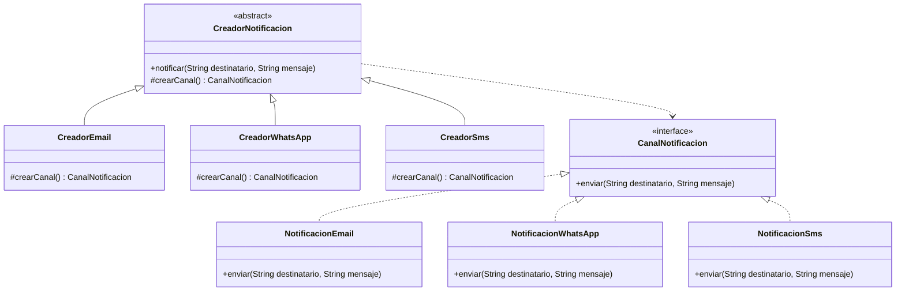

# Factory Method

## Problema

En un e-commerce, el sistema puede necesitar enviar notificaciones por distintos canales: email, WhatsApp o SMS.

Si en cada parte del sistema creamos directamente las clases concretas con `new`, el código queda acoplado a esas
implementaciones.

Por ejemplo, sin aplicar el patrón podríamos terminar repitiendo lógica como esta:

```java
CanalNotificacion canal = new NotificacionEmail();
canal.enviar("bren@email.com","Tu pedido fue creado correctamente");
```

O también podríamos tener condicionales para decidir qué clase concreta instanciar:

```java
if(tipoNotificacion.equals("EMAIL")) {
    canal = new NotificacionEmail();
    } else if(tipoNotificacion.equals("WHATSAPP")) {
    canal = new NotificacionWhatsApp();
    } else if(tipoNotificacion.equals("SMS")) {
    canal = new NotificacionSms();
}
```

El problema de este enfoque es que el código cliente conoce demasiadas clases concretas y la lógica de creación puede
quedar repetida en distintos lugares del sistema.

## Solución

Factory Method permite delegar la creación de objetos a subclases creadoras.

En lugar de que el código cliente instancie directamente `NotificacionEmail`, `NotificacionWhatsApp`
o `NotificacionSms`, se define una clase creadora base con un método factory.

Cada subclase creadora redefine ese método y decide qué canal concreto crear.

De esta forma, el código cliente trabaja con una abstracción y no queda acoplado directamente a las clases concretas de
notificación.

## Ejemplo en este proyecto

Se define una interfaz común para todos los canales de notificación:

```java
public interface CanalNotificacion {
    void enviar(String destinatario, String mensaje);
}
```

Luego se crean distintas implementaciones concretas:

* `NotificacionEmail`
* `NotificacionWhatsApp`
* `NotificacionSms`

También se define una clase creadora abstracta:

```java
public abstract class CreadorNotificacion {

    public void notificar(String destinatario, String mensaje) {
        CanalNotificacion canal = crearCanal();
        canal.enviar(destinatario, mensaje);
    }

    protected abstract CanalNotificacion crearCanal();
}
```

El método `crearCanal()` es el Factory Method.

La clase `CreadorNotificacion` define el flujo general para enviar una notificación, pero delega en las subclases la
decisión de qué canal concreto crear.

Después, cada creador concreto implementa el método factory:

```java
public class CreadorEmail extends CreadorNotificacion {

    @Override
    protected CanalNotificacion crearCanal() {
        return new NotificacionEmail();
    }
}
```

```java
public class CreadorWhatsApp extends CreadorNotificacion {

    @Override
    protected CanalNotificacion crearCanal() {
        return new NotificacionWhatsApp();
    }
}
```

```java
public class CreadorSms extends CreadorNotificacion {

    @Override
    protected CanalNotificacion crearCanal() {
        return new NotificacionSms();
    }
}
```

## Diagrama UML



En este diagrama se puede ver que `CreadorEmail`, `CreadorWhatsApp` y `CreadorSms` heredan de `CreadorNotificacion` y
redefinen el método `crearCanal()`.

También se puede ver que `NotificacionEmail`, `NotificacionWhatsApp` y `NotificacionSms` implementan la
interfaz `CanalNotificacion`.

Cada creador concreto decide qué implementación de `CanalNotificacion` crear. Por ejemplo, `CreadorEmail` devuelve una
instancia de `NotificacionEmail`.

## Código principal

El código cliente trabaja con la clase abstracta `CreadorNotificacion`, sin crear directamente las notificaciones
concretas.

```java
CreadorNotificacion creadorEmail = new CreadorEmail();
creadorEmail.notificar("bren@email.com", "Tu pedido fue creado correctamente");
```

La ventaja es que el código cliente no instancia directamente `NotificacionEmail`.

La creación del canal queda encapsulada dentro del método factory `crearCanal()`.

## Estructura del ejemplo

```text
factorymethod/
│
├── CanalNotificacion.java
├── CreadorNotificacion.java
├── CreadorEmail.java
├── CreadorWhatsApp.java
├── CreadorSms.java
├── FactoryMethodDemo.java
├── NotificacionEmail.java
├── NotificacionSms.java
└── NotificacionWhatsApp.java
```

## Cuándo usar Factory Method

Conviene usar este patrón cuando:

* Existen varias clases que implementan una misma interfaz.
* Queremos delegar la creación de objetos a subclases.
* El código cliente no debería depender directamente de clases concretas.
* Se busca reducir el acoplamiento entre el código que usa un objeto y el código que lo crea.
* Se quiere respetar mejor el principio abierto/cerrado, permitiendo agregar nuevas variantes sin modificar la lógica
  principal.

## Cuándo no usarlo

No conviene aplicarlo si:

* Solo existe una implementación concreta.
* La creación del objeto es muy simple y no hay variaciones.
* Agrega más clases sin aportar flexibilidad real.
* Una fábrica simple alcanza para resolver el problema sin necesidad de herencia.

## Resumen

Factory Method es un patrón creacional que permite delegar la creación de objetos a subclases creadoras.

En este ejemplo, el e-commerce puede enviar notificaciones por distintos canales. La clase
abstracta `CreadorNotificacion` define el flujo general para notificar, pero deja que cada subclase concreta decida qué
canal crear.

De esta forma, el código queda más flexible, menos acoplado a clases concretas y más fácil de extender si en el futuro
se agrega un nuevo canal, como notificaciones push.
