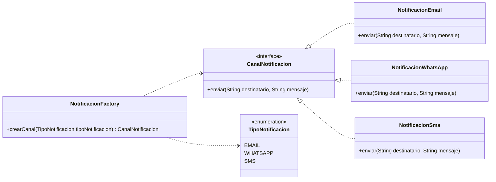

# Factory Method

## Problema

En un e-commerce, el sistema puede necesitar enviar notificaciones por distintos canales: email, WhatsApp o SMS.

Si en cada parte del sistema creamos directamente las clases concretas con `new`, el código queda acoplado a esas implementaciones.

Por ejemplo, sin aplicar el patrón podríamos terminar repitiendo lógica como esta:

``` java
if (tipoNotificacion == TipoNotificacion.EMAIL) {
    canal = new NotificacionEmail();
} else if (tipoNotificacion == TipoNotificacion.WHATSAPP) {
    canal = new NotificacionWhatsApp();
} else if (tipoNotificacion == TipoNotificacion.SMS) {
    canal = new NotificacionSms();
}
```

El problema de este enfoque es que el código cliente conoce demasiadas clases concretas y la lógica de creación puede quedar repetida en distintos lugares del sistema.

## Solución

Factory Method permite centralizar la creación de objetos en una fábrica.

El código cliente pide un canal de notificación y trabaja con una interfaz común, sin preocuparse por qué clase concreta se instancia.

En este caso, el código cliente no necesita saber si está usando una notificación por email, WhatsApp o SMS. Solo necesita saber que tiene un objeto que cumple con la interfaz `CanalNotificacion`.

## Ejemplo en este proyecto

Se define una interfaz común:

```java
public interface CanalNotificacion {
    void enviar(String destinatario, String mensaje);
}
```

Luego se crean distintas implementaciones:

- `NotificacionEmail`
- `NotificacionWhatsApp`
- `NotificacionSms`

La clase `NotificacionFactory` recibe un `TipoNotificacion` y devuelve el canal correspondiente.

```java
public class NotificacionFactory {
    public CanalNotificacion crearCanal(TipoNotificacion tipoNotificacion) {
        return switch (tipoNotificacion) {
            case EMAIL -> new NotificacionEmail();
            case WHATSAPP -> new NotificacionWhatsApp();
            case SMS -> new NotificacionSms();
        };
    }
}
```

## Diagrama UML



En este diagrama se puede ver que `NotificacionEmail`, `NotificacionWhatsApp` y `NotificacionSms` implementan la interfaz `CanalNotificacion`.

La clase `NotificacionFactory` recibe un `TipoNotificacion` y devuelve un objeto del tipo `CanalNotificacion`, centralizando la creación de los distintos canales de notificación.

## Código principal

El código cliente usa la fábrica para obtener un canal de notificación:

``` java
NotificacionFactory factory = new NotificacionFactory();

CanalNotificacion canal = factory.crearCanal(TipoNotificacion.EMAIL);

canal.enviar(
        "bren@email.com",
        "Tu pedido fue creado correctamente"
);
```

La ventaja es que el código cliente trabaja contra la interfaz `CanalNotificacion`, no contra una clase concreta como `NotificacionEmail`.

## Estructura del ejemplo

```text
factorymethod/
│
├── CanalNotificacion.java
├── FactoryMethodDemo.java
├── NotificacionEmail.java
├── NotificacionFactory.java
├── NotificacionSms.java
├── NotificacionWhatsApp.java
└── TipoNotificacion.java
```

## Cuándo usar Factory Method

Conviene usar este patrón cuando:

- Existen varias clases que implementan una misma interfaz.
- La creación del objeto depende de una condición, configuración o tipo.
- Se quiere evitar repetir `new` y lógica condicional en distintas partes del sistema.
- Se busca reducir el acoplamiento entre el código cliente y las clases concretas.

## Cuándo no usarlo

No conviene aplicarlo si:

- Solo existe una implementación concreta.
- La creación del objeto es muy simple y no hay variaciones.
- Agrega más complejidad de la necesaria para el problema actual.

## Resumen

Factory Method es un patrón creacional que permite crear objetos sin acoplar el código cliente a clases concretas.

En este ejemplo, el e-commerce puede enviar notificaciones por distintos canales. En lugar de que el código cliente decida manualmente qué clase instanciar, esa responsabilidad queda centralizada en `NotificacionFactory`.

Esto hace que el código sea más flexible, más fácil de mantener y más simple de extender si en el futuro se agrega un nuevo canal, como notificaciones push.