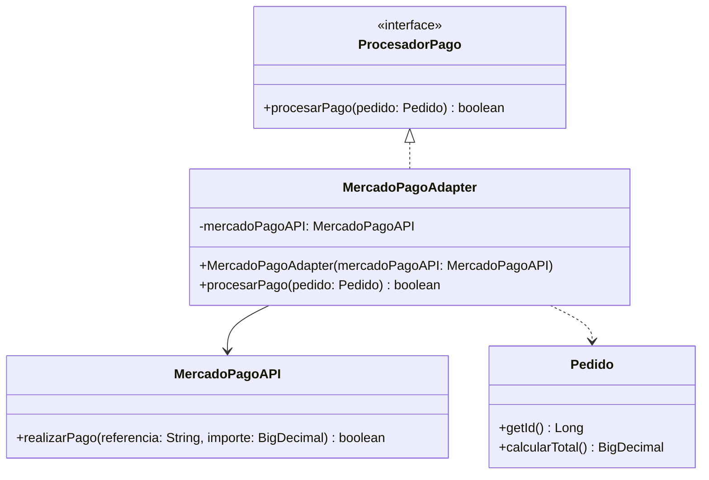

# Adapter

## Problema

En un e-commerce es común necesitar integrar servicios externos, como pasarelas de pago, sistemas de envío o APIs de terceros.

El problema es que estos servicios suelen tener interfaces distintas a las que espera nuestro sistema. Si utilizáramos directamente esas clases externas, el código del e-commerce quedaría fuertemente acoplado a una implementación específica.

En este ejemplo, el sistema espera trabajar con la interfaz `ProcesadorPago`, mientras que la API de Mercado Pago expone una interfaz diferente para procesar el pago.

---

## Solución

El patrón **Adapter** permite reutilizar una clase existente cuya interfaz no es compatible con la que necesita nuestro sistema.

Para lograrlo, se crea una clase adaptadora que implementa la interfaz esperada por el cliente y traduce las llamadas hacia la API externa.

De esta manera, el resto del sistema continúa trabajando con la interfaz `ProcesadorPago`, sin conocer los detalles de implementación del servicio externo.

---

## Antes y después de aplicar Adapter

### Sin Adapter

El e-commerce debería conocer directamente cómo funciona la API de Mercado Pago.

```java
MercadoPagoAPI mercadoPago = new MercadoPagoAPI();

mercadoPago.realizarPago("PED-1", pedido.calcularTotal());
```

Esto acopla el e-commerce directamente a la API externa, haciendo que cualquier cambio en esa integración impacte en el resto del sistema.

### Con Adapter

El sistema solamente conoce la interfaz `ProcesadorPago`.

```java
ProcesadorPago procesadorPago = new MercadoPagoAdapter(new MercadoPagoAPI());

procesadorPago.procesarPago(pedido);
```

El Adapter se encarga de convertir la información del `Pedido` al formato que necesita Mercado Pago.

---

## Ejemplo en este proyecto

En este ejemplo, el e-commerce construye un `Pedido` mediante el patrón **Builder**.

Luego, cuando llega el momento de procesar el pago, el sistema trabaja únicamente con la interfaz `ProcesadorPago`.

El `MercadoPagoAdapter` recibe el pedido, obtiene la referencia y el importe, y adapta esa información para invocar correctamente la API de Mercado Pago.

De esta manera, el resto del sistema continúa trabajando con objetos del dominio (`Pedido`), mientras que el Adapter se ocupa de traducirlos al formato esperado por la API externa.

Así, el resto del sistema permanece desacoplado de la implementación concreta del servicio de pagos.

---

## ¿Por qué recibir la API por constructor?

El `MercadoPagoAdapter` recibe una instancia de `MercadoPagoAPI` mediante su constructor.

```java
public MercadoPagoAdapter(MercadoPagoAPI mercadoPagoAPI) {
    this.mercadoPagoAPI = mercadoPagoAPI;
}
```

De esta forma, el Adapter no es responsable de crear la API externa, sino únicamente de adaptarla.

Además, este enfoque facilita reemplazar la implementación por otra distinta o utilizar simulaciones durante las pruebas.

---

## Diagrama UML



---

## Código principal

```java
MercadoPagoAPI mercadoPagoAPI = new MercadoPagoAPI();

ProcesadorPago procesadorPago = new MercadoPagoAdapter(mercadoPagoAPI);

boolean pagoExitoso = procesadorPago.procesarPago(pedido);

if (pagoExitoso) {
    pedido.pagar();
}
```

---

## Estructura del ejemplo

```
adapter
├── ProcesadorPago
├── MercadoPagoAPI
├── MercadoPagoAdapter
└── AdapterDemo
```

---

## Código fuente

El código completo del ejemplo se encuentra en:
[Ver código de Adapter](../../src/main/java/com/bren/patrones/estructurales/adapter)

---

## Cuándo usar Adapter

Utilizá Adapter cuando:

- Necesitás integrar una API externa con una interfaz diferente.
- Querés reutilizar una clase existente sin modificar su código.
- Buscás desacoplar tu sistema de implementaciones concretas.
- Querés mantener una interfaz común para distintas integraciones.

---

## Cuándo no usar Adapter

No conviene utilizar Adapter cuando:

- Ambas clases ya poseen interfaces compatibles.
- No existe una incompatibilidad entre el cliente y el servicio utilizado.
- Agregar una clase adaptadora solo aumentaría la complejidad sin aportar beneficios.

---

## Resumen

El patrón **Adapter** permite que dos clases con interfaces incompatibles puedan colaborar sin modificar su implementación.

En este proyecto, el e-commerce continúa trabajando con la interfaz `ProcesadorPago`, mientras que `MercadoPagoAdapter` adapta un `Pedido` para comunicarse correctamente con la API de Mercado Pago.

Gracias a este desacoplamiento, el sistema puede incorporar nuevas integraciones sin modificar el código que utiliza `ProcesadorPago`.